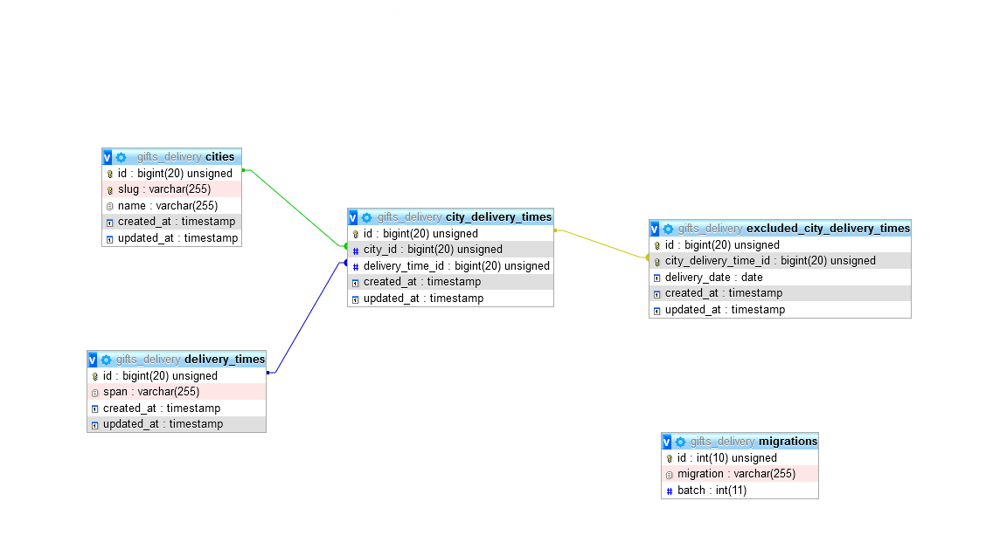

# Delivery date/time Problem

### API endpoints :

**Post:**

* **/api/cities :**

  * JSON request body: { "name": "Tangier" }

* **/api/delivery-times**

  * JSON request body: { "span": "18PM->20PM" }

* **/api/cities/{id}/delivery-times**

  * request body :

    { "delivery_times": [ { "delivery_time_id": 3 }, { "delivery_time_id": 5 } ] }

* **/api/cities/{id}/excluded-delivery-times**

  * JSON request body :

    {
        "delivery_date": "2019-12-28",
        "excluded_delivery_times": [
            {
                "city_delivery_time_id": 2
            }
        ]
    }

* **/api/cities/{id}/exclude-delivery-date**

  * JSON request body : { "delivery_date": "2019-12-29" }

**Get:**

* **/api/cities/{id}/delivery-dates-times/{days_count}**

### Database  (MySQL) :

#### Schema :



#### Config :

* Collation : utf8mb4_general_ci

* Engine: InnoDB

**N.B** : Please run the following command in your terminal before testing the API in order to migrate the database tables:

```
 php artisan migrate
```

### Dev Environment :

* Composer version 1.9.1
* PHP 7.4.1
* Laravel Framework 6.9.0
* MySQL 5.7.28
* IDE: PhpStorm 2019

### Notes:

* For simplicity purposes exceptions are not handled, we consider that the incoming data is always correct.
* There is not unit tests in this project because I was still exploring and getting my hands dirty with PHP and Laravel and to save some time (I have an open source [C# project](https://github.com/whyrising/mvvm-utils) where I wrote quite a lot of tests in case you want to take a look )
* Since this project is just an MVP (Minimum Viable Product) , there is really no need to make any complex architectural decisions (to save some time too), however, as the project grows, it is our responsibility to keep refactoring along with writing tests until the design reveals itself.
* **Please don't hesitate to contact me in case you have any question :  ).**

